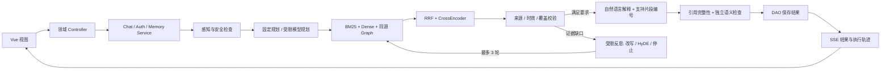

# MediAtlas · 医学证据工作台

基于原 `medical_disease_db` 改造的医学知识工作台。它把疾病知识、公开来源和对话上下文连接起来，让 AI 围绕问题组织有依据的解释，并展示出处、检索和校验过程。定位是个人学习与研究工作台，尚未经过临床验证。

## 启动

当前电脑的配置已放在 **`backend/.env`**。原项目目录保持不变，副本中只有一个后端入口 `backend/main.py`，没有 `app` 包。

```powershell
cd C:\workspace\medical_disease_db\medical_agentic_rag
.\Start.ps1
# 前端修改后：.\Start.ps1 -Build
# 前台运行：.\Start.ps1 -Foreground
# 停止后台服务：.\Stop.ps1
```

默认页面：<http://127.0.0.1:8010>；接口文档：<http://127.0.0.1:8010/docs>。首次加载本地模型需要时间，日志位于 `logs/`。单机单进程运行；不要添加多个 Uvicorn worker 来重复加载 GPU 模型。

在其他电脑安装：Python 3.12、Node 22.12+ 或 24，按硬件安装 PyTorch，然后执行 `pip install -r backend/requirements.txt`、`cd frontend; npm ci; npm run build`。复制 `backend/.env.example` 为 `backend/.env`，配置本地模型及数据库，创建独立数据库 `medical_agentic_rag` 后启动。程序不会自动下载模型或读取原项目的网络安全向量库。

## 核心设计



- **MVC 与领域分层**：`auth/user/chat/memory/rag` 分为 `controller/service/dao/entity`（按领域实际职责设置），`common/ApplicationContext.py` 统一装配，`ai` 封装外部模型和数据库连接，`create_data` 负责离线构建。
- **编排 RAG 是主流程**：固定检索、融合、排序和校验可独立评测。模型不能关闭证据门槛。
- **受限 Agent 是可选决策层**：感知当前意图与会话实体；复杂问题规划检索文本；执行只读检索；观察来源缺口与覆盖；选择改写、HyDE 或停止；使用四层记忆。结构化响应经过 Pydantic 与动作白名单双重约束。
- **模型分工**：回答沿用原 GLM `glm-4.5-air`，可通过原 DeepSeek 配置切换；Agent 使用 OpenCode Go `deepseek-v4-flash`。密钥只存在本地 `.env`。服务明确标识为 MediAtlas，不伪装成其他客户端。
- **硬限制**：最多 3 轮检索、6 次模型请求、单请求默认 90 秒、模型请求 20 秒、全局 2 个任务、同一用户 1 个进行中任务。急症、个人剂量、特殊人群等规则先于模型执行。重复证据或无新条件会终止。
- **有依据的自然解释**：GLM 可归纳、改写和解释术语，通过支持片段编号引用原始资料，程序回填对应原文。另一模型调用检查回答是否切题、是否受引用支持、是否错误推广。失败最多修复一次，服务不可用时明确标注摘录降级。界面不展示模型内部思维链。

### 两种回答模式

| | 权威模式（默认） | 探索模式 |
|---|---|---|
| 检索范围 | 已核验公开来源及同源关系 | 公开来源 + 全部历史疾病文档 + 原图谱 |
| 来源门槛 | 核验状态、出处与时效校验 | 接受可追溯的待复核资料，明确显示状态 |
| 覆盖要求 | 问题涉及的疾病与知识分面必须覆盖 | 允许部分覆盖，标明缺失维度 |
| 回答输出 | 基于核验来源的自然解释 | 标明资料状态的自然解释 |

两种模式共享急症、个体剂量、特殊人群用药与引用真实性检查。模式由用户选择，模型无法自行切换。历史记录与导出保留每次回答的模式。例如“阑尾炎有哪些症状”“高血压挂什么科”可在探索模式使用历史条目；权威模式缺少对应核验内容时会说明证据不足。

## 存储与四层记忆

| 层 / 存储 | 内容 | 生命周期与权限 |
|---|---|---|
| L1 工作记忆 / 请求对象 | 当前问题、解析结果、运行上下文 | 单次请求，用户间不共享 |
| L2 短期记忆 / Redis | 最近 6 轮的实体与结果状态 | 默认 24 小时 TTL，版本校验；失败回退持久层 |
| L3 情节记忆 / PostgreSQL | 已完成问答、引用、执行轨迹 | 按账户与会话隔离，可删除对话 |
| L4 长期语义记忆 / PostgreSQL | 用户明确确认的表达偏好、背景和学习方向 | 查看、修改、删除；不自动推断诊断 |
| Neo4j | 原有疾病关系图谱 | 固定参数化只读查询，无任意 Cypher 工具 |
| SQLite 知识目录 + Chroma | 来源、分块、全文索引与向量 | 与账户数据分开，离线版本发布 |

MySQL 适配器仍保留，设置 `MED_DATABASE_BACKEND=mysql` 可切换；它与 PostgreSQL 二选一，不会同时写两套业务表。SQLite 业务适配器用于离线测试。缓存只使用 `mediatlas:` 前缀，不执行 Redis 清库。

长期偏好目前只影响简洁展示；背景与学习方向可持久保存，但不会被当作诊断证据或自动发送给模型。访客会话默认 7 天有效；账户重新登录延续自己的持久记录。会话过期不等于磁盘数据自动销毁，清理策略见架构说明。

## 数据与灌库

原 `medical.json` 的 8,806 个有效唯一疾病形成 103,008 份历史文档与 247,899 条本地图边。追加用户提供的中文 WHO 2,498 条、英文 WHO 5,835 条后，来源核验层从 29 条增至 8,362 条；再补充共 15 条 NHS／NIDDK／WHO 官方页面的中文整理摘要，目前核验层 **8,377 条**、合计 **111,385 份知识文档**。历史文档、本地图边和 Neo4j 的 383,229 条关系保持原样。合并记录见 `reports/who-merge.json`、`reports/source-support.json`；原内容逐行哈希核对见 `reports/data-integrity.json`。

核验状态表示已记录公开来源及检查日期，不等于医生审核。采集器曾把抓取日期填成发布日期，已清除这些虚假发布日期并保留显式日期来源说明。中英文同一 WHO 页面使用相同 source_id，避免把翻译版本算成两个独立证据。

**QA 数据集已停用**：按项目最新的数据质量决定，取消 12% 导入，`MED_QA_ENABLED=false` 为默认设置。旧 QA 索引即使仍在磁盘也不会加载到检索、知识搜索或回答流程，原始数据文件保留。已有 QA 导入报告属于历史实验，不代表当前服务的数据范围。

核验资料使用本地向量检索，历史疾病全量进入磁盘全文索引和同源图查询。精确实体与分面召回补足定义类查询，主题过滤会拒绝只匹配“原因、可能、问题”等通用词的结果。探索模式扩大来源范围，但不跳过主题与引用检查。

## 验证与评测

```powershell
cd backend
python -m unittest discover -s tests -v
python -m tests.verify_services
python -m evaluation.EvaluationRunner --models
# 明确启用外部模型调用：
python -m evaluation.EvaluationRunner --models --llm
python -m evaluation.AnswerQualityRunner --models --llm --cases evaluation/comprehensive_cases.json
python -m tests.verify_data
```

评测包含 BM25、Dense、RRF、Graph、Rerank 的消融，Recall@5/MRR/nDCG@5，以及固定 RAG 与受限 Agent 的路由通过率、轮数、耗时和模型调用数。结果写入 `reports/evaluation.json` 并展示在网页；逐条检索依据保存在 `reports/retrieval-details.json`。

39 条开发回归集覆盖双模式路由、急症和用药边界；`evaluation/quality_cases.json` 另有 28 组普通人就医场景问题（39 条按双模式展开），检查主题覆盖、偏题词、篇幅、是否完成自然解释、是否排除 QA，并保存完整回答供人工审阅。词项测试和模型审阅都不能证明临床正确率。

旧 32 条种子集保存在 `evaluation/cases-seed29.json`，WHO 扩展后有 3 条旧缺证据问题获得来源。检索消融使用核验来源的疾病 / 分面 qrels，属于开发集，尚缺独立医生标注。当前不宣称 Agent 必然优于固定 RAG；报告同时展示效果、耗时和调用成本。

更多设计、原项目问题及 PDF 方案取舍见 [架构与取舍](docs/ARCHITECTURE.md)。原源码快照位于 `docs/original-source.zip`，原文件哈希清单位于 `docs/original-manifest.json`。

本轮实际问答质量审阅、发现的问题和改动记录见 [2026-09-08 质量审阅](docs/quality-review-2026-09-08.md)。`comprehensive_cases.json` 包含 52 条按模式展开的问答，增加追问、口语急症、否定表达和注入场景；保存代码指纹、实际模型状态及逐条结果。生成检查失败不会自动转成历史资料摘录。
